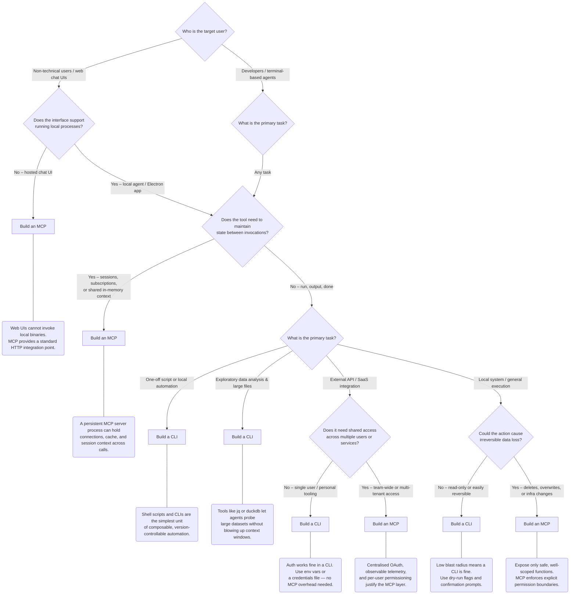

```mermaid
flowchart TD
    Start{Who is the target user?}

    Start -->|Non-technical users / web chat UIs| WebUI{Does the interface support<br/>running local processes?}
    WebUI -->|No – hosted chat UI| A[Build an MCP]
    A --- A_Desc(Web UIs cannot invoke local binaries.<br/>MCP provides a standard HTTP integration point.)
    WebUI -->|Yes – local agent / Electron app| Stateful

    Start -->|Developers / terminal-based agents| Task{What is the primary task?}

    Task -->|Any task| Stateful{Does the tool need to maintain<br/>state between invocations?}
    Stateful -->|Yes – sessions, subscriptions,<br/>or shared in-memory context| H[Build an MCP]
    H --- H_Desc(A persistent MCP server process can hold<br/>connections, cache, and session context across calls.)
    Stateful -->|No – run, output, done| TaskType{What is the primary task?}

    TaskType -->|One-off script or local automation| B[Build a CLI]
    B --- B_Desc(Shell scripts and CLIs are the simplest unit<br/>of composable, version-controllable automation.)

    TaskType -->|Exploratory data analysis & large files| C[Build a CLI]
    C --- C_Desc(Tools like jq or duckdb let agents probe<br/>large datasets without blowing up context windows.)

    TaskType -->|External API / SaaS integration| MultiUser{Does it need shared access<br/>across multiple users or services?}
    MultiUser -->|No – single user / personal tooling| D[Build a CLI]
    D --- D_Desc(Auth works fine in a CLI. Use env vars or<br/>a credentials file — no MCP overhead needed.)
    MultiUser -->|Yes – team-wide or multi-tenant access| E[Build an MCP]
    E --- E_Desc(Centralised OAuth, observable telemetry,<br/>and per-user permissioning justify the MCP layer.)

    TaskType -->|Local system / general execution| Destructive{Could the action cause<br/>irreversible data loss?}
    Destructive -->|No – read-only or easily reversible| F[Build a CLI]
    F --- F_Desc(Low blast radius means a CLI is fine.<br/>Use dry-run flags and confirmation prompts.)
    Destructive -->|Yes – deletes, overwrites, or infra changes| G[Build an MCP]
    G --- G_Desc(Expose only safe, well-scoped functions.<br/>MCP enforces explicit permission boundaries.)
```
